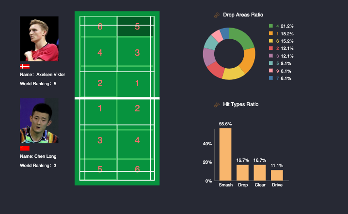

# Data Visualization of Badminton Athletes
## Concept
After interviewing 10+ badminton athletes in China Badminton Team, one of the biggest challenges they are facing now in terms of tournament performance is to analyze and prepare for international opponents. Their current strategy is watching tournament recordings. However, the issue here is each match would take up to more than 100 minutes and players usually have lots of repetitive tactics. That is being said, watching tournament recordings is very *time consuming*. 

In order to make the process of analyzing opponents more efficient. I will interpret video recordings into data to provide a more directive way to analyze athletes' common strategies and tactics used in matches. 

## Project Overview
In this project, the main strategy is to divide each side of a badminton court into 6 parts and visualize the data of each part of the court. Users would have full freedom to choose which events (men's singles, mens's doubles, women's singles, women's doubles, and mixed doubles) and which player/s.

The demo provided above is the data visualization of area 5 on Axelsen Viktor's side. When the user clicks area 5, the two diagrams on the right side would update simultaneously with the data of *Drop Areas Ratio* and *Hit Type Ratio*.

## Challenges
The current challenge is there is no open data I could directly use. I collaborated with one of my friends who specialized in computer vision to transform video recordings into data points. The issue here is our current model is not very accurate which would influence the result of each diagram.

## Next Steps
### Diagrams

Besides the two categories presented in the demo screenshot above, I will implement more analysis diagram.

### Data
I will add more data from more players.

### Selection Fields
With more players' data added, I will add more selection fields to allow users to select events and players.