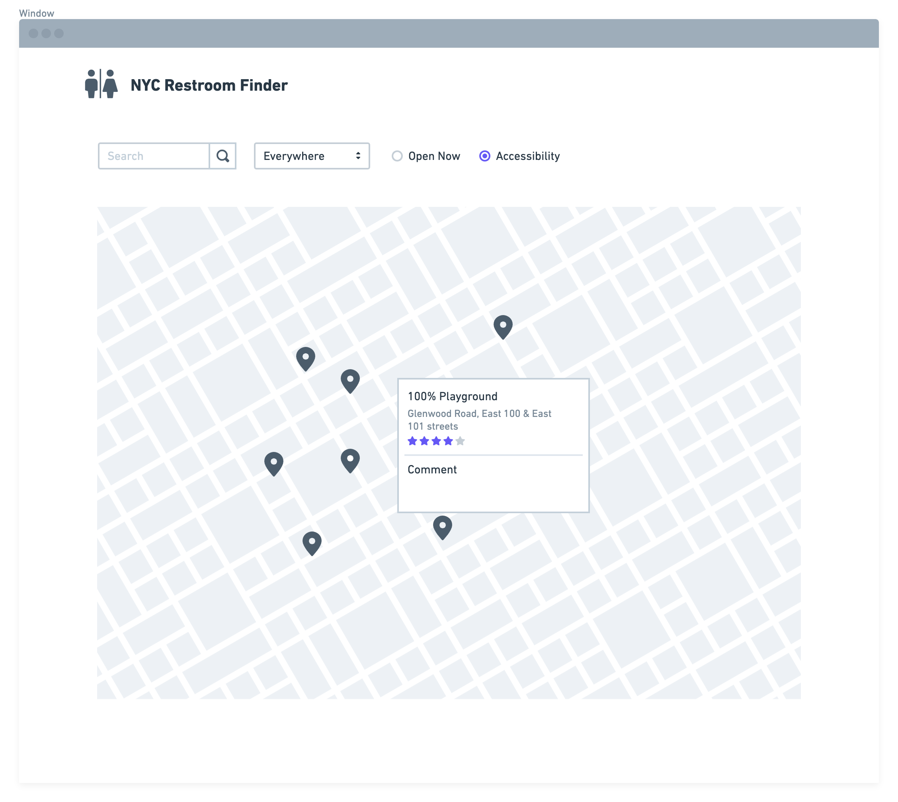
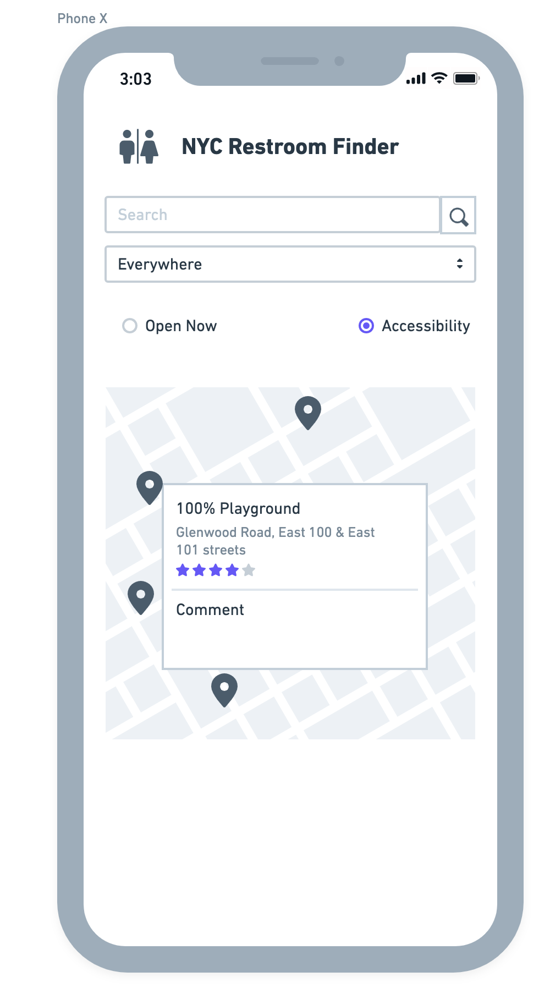

# Week 3 - Media Queries
## Idea 
Due to the time limit, I do not think my previous idea will be durable. Therefore, I changed my scope to a more specific aspect - NYC public restroom finder.

### Why?
It's always difficult to find a restroom in NYC. Even if you find one, it's probably not your ideal one, in terms of environment, accessibility, etc.

### Features
- Map to find nearby restroom.
- Filters to filter out unnecessary information.
- Comment/ score visited restrooms.
- Chat with people in the same restroom to not get bored.

## Sketch
### Web

### Mobile
